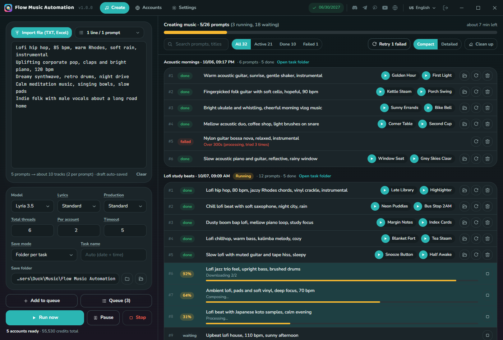
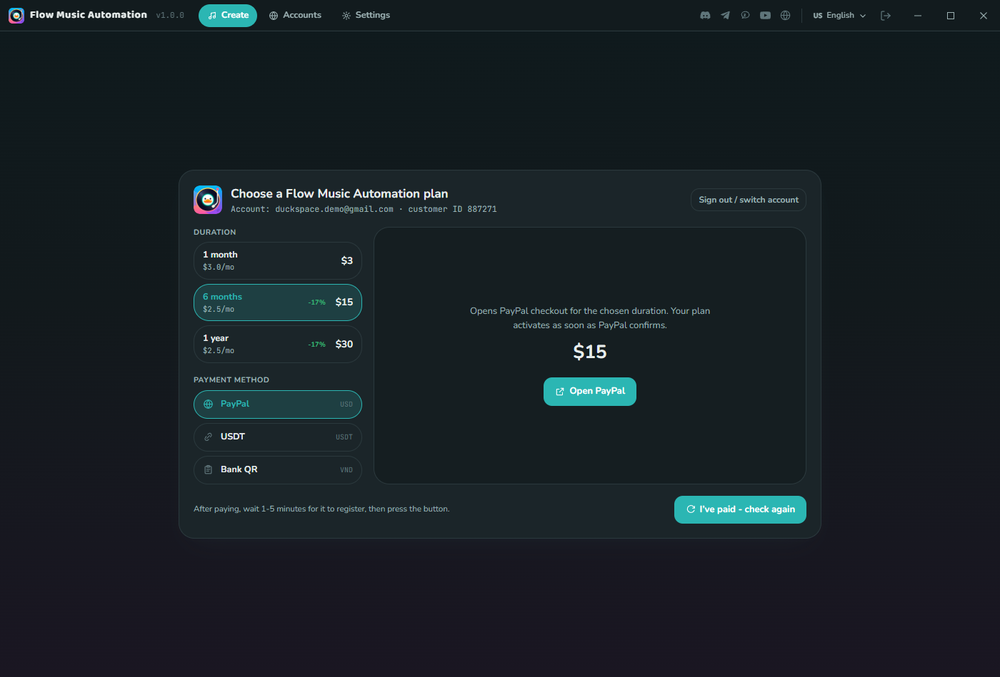
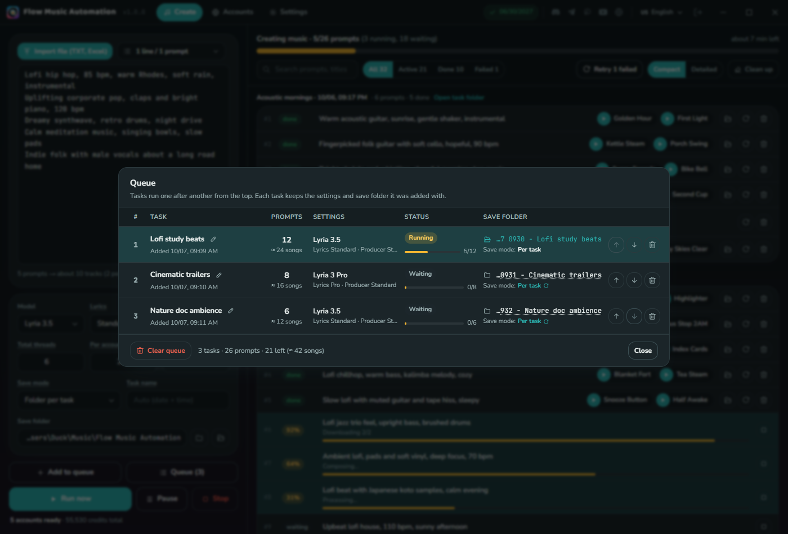
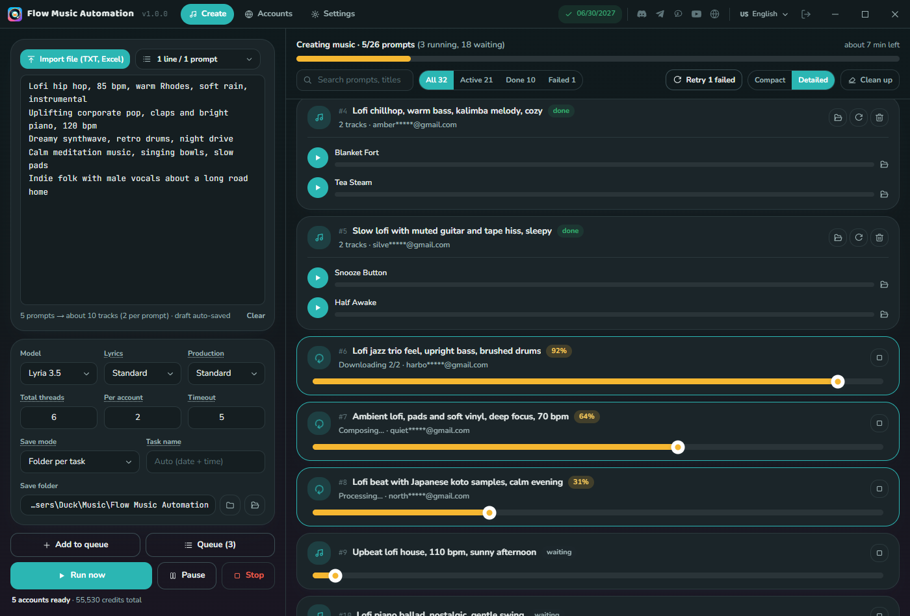
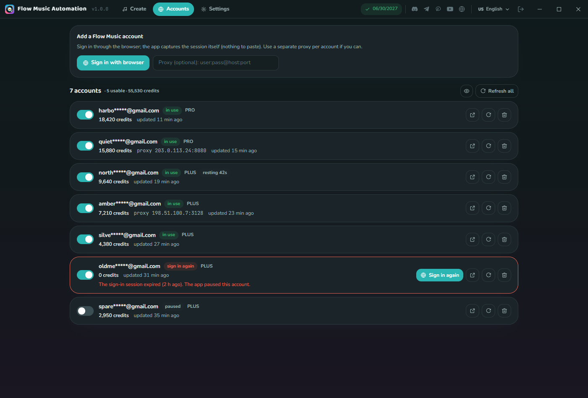
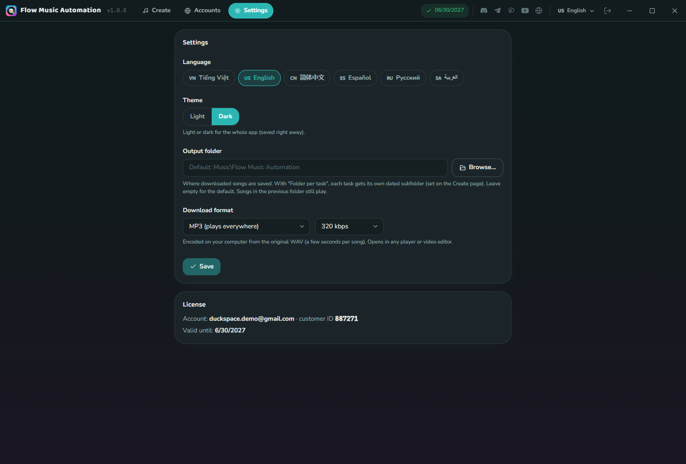
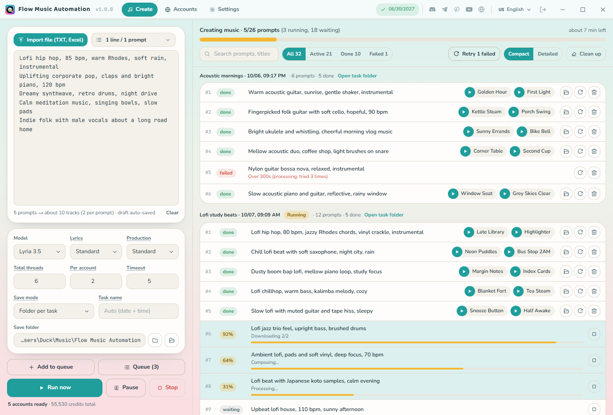
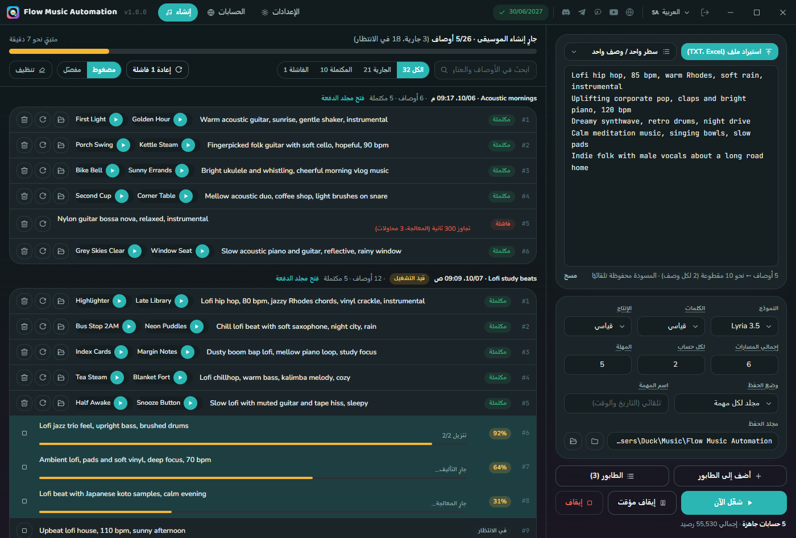

<h1 align="center">Flow Music Automation</h1>

<p align="center"><b>A desktop app (Windows &amp; macOS) for batch music creation on Google Flow Music (Lyria): paste a whole list of prompts, split them into queued tasks, run them in parallel across several accounts and save MP3 / M4A / WAV straight to your computer.</b></p>

<p align="center">
  <b>English</b> ·
  <a href="README.vi.md">Tiếng Việt</a>
</p>

<p align="center">
  <a href="https://github.com/duckmartians/Flow-Music-Automation/releases/latest"></a>&nbsp;
  <a href="https://github.com/duckmartians/Flow-Music-Automation/releases/latest"></a>&nbsp;
  <a href="https://github.com/duckmartians/Flow-Music-Automation/releases/latest"></a>
</p>



---

## Installation

### Step 1 - Pick the right file for your computer

Open the latest release under **[Releases](https://github.com/duckmartians/Flow-Music-Automation/releases/latest)** and download the file that matches your computer (`<version>` is the version number, e.g. `1.0.0`):

| Your computer | Download | Notes |
|---|---|---|
| 🪟 **Windows 10 / 11 (64-bit)** | [`FlowMusicAutomation-<version>-win-x64.exe`](https://github.com/duckmartians/Flow-Music-Automation/releases/latest) | Installer |
| 🍎 **Mac with Apple chip (M1/M2/M3/M4)** | [`FlowMusicAutomation-<version>-mac-arm64.dmg`](https://github.com/duckmartians/Flow-Music-Automation/releases/latest) | Macs from about late 2020 onward |
| 🍎 **Mac with Intel chip** | [`FlowMusicAutomation-<version>-mac-intel.dmg`](https://github.com/duckmartians/Flow-Music-Automation/releases/latest) | Older Macs (before 2020) |

**Not sure which chip your Mac has?** Click the  menu at the top left → **About This Mac**:
- A **Chip** line saying "Apple M1 / M2 / M3…" → get the **arm64** build.
- A **Processor** line saying "Intel…" → get the **intel** build.

> The **Intel** build still runs on an Apple-chip Mac, just slower; the **arm64** build **won't open** on an Intel Mac. Pick the right one.

Besides the app, you need:

| You need | Notes |
|---|---|
| **Google Chrome** | The app opens Chrome so you can sign in to your Flow Music accounts |
| **Flow Music accounts** | One or more Google accounts that can use [flowmusic.app](https://www.flowmusic.app); songs are paid for with these accounts' credits |

### Step 2 - Install

<details open>
<summary><b>🪟 On Windows</b></summary>

1. Open the **`FlowMusicAutomation-<version>-win-x64.exe`** you downloaded.
2. If **"Windows protected your PC"** (SmartScreen) appears: click **More info** → **Run anyway**. *(The app isn't signed with a Microsoft certificate, so Windows warns about it. It is not a virus.)*
3. Pick the install folder, wait for the installer to finish, then open **Flow Music Automation** from the **Start Menu**.

</details>

<details open>
<summary><b>🍎 On macOS</b></summary>

1. Open the downloaded **`.dmg`** and **drag Flow Music Automation into the Applications folder**.
2. In **Applications**, **right-click** (or Control-click) **Flow Music Automation** → **Open** → click **Open** again in the dialog. *(The app is only ad-hoc signed, without an Apple Developer ID, so the **first** launch has to go this way; after that it opens normally.)*
3. If macOS says the app **"is damaged / can't be opened"**, or there is no Open button, open **Terminal** and paste:
   ```bash
   xattr -dr com.apple.quarantine "/Applications/Flow Music Automation.app"
   ```
   Then open the app again.

</details>

### Step 3 - Sign in &amp; get a plan

**You need a G-Labs account with an active Flow Music Automation plan. There is no free tier.** Open the app and sign in with Google; without a plan, the app shows the purchase screen. The plan is separate from the G-Labs Studio plans, is time-based and never auto-renews:

| Duration | Bank QR (VietQR) | PayPal / USDT |
|---|---|---|
| 1 month | 50,000₫ | $3 |
| 6 months | 250,000₫ | $15 |
| 1 year | 500,000₫ | $30 |



Every plan unlocks every feature. Pay right inside the app by **bank QR (VietQR)**, **PayPal** or **USDT** (USDT is activated by hand: after paying, message [@duckmartians](https://t.me/duckmartians) on Telegram as the purchase screen explains). One account runs on **one computer at a time**: signing in on another computer signs the old one out. The green badge in the title bar shows when your plan expires.

The app **updates itself**: the version badge in the title bar checks GitHub Releases, downloads the new installer and **verifies its digital signature** before using it; a release without a valid signature is never installed. On Windows the app runs the new installer right away; on macOS it opens the new `.dmg` so you can drag the app into Applications again.

---

## First run

1. **Add your Flow Music accounts** on the **Accounts** tab: click **Sign in with browser**, sign in to Google in the Chrome window that opens, and the app captures the session itself (nothing to paste). Repeat for each account. If you use proxies, paste one in the box next to the button first.
2. **Enter prompts** on the **Create** tab: one prompt per line, or **Import file** from TXT / CSV / Excel. Each prompt makes **2 tracks**.
3. **Choose the model and how to save**: model, lyrics, production, threads, save mode, task name, save folder.
4. Click **Run now**. To line up several batches, click **Add to queue** for each one and then **Run now**: the tasks run one after another.
5. Finished songs appear in the list right away: click ▶ to listen, or the folder icon to show the file in Explorer / Finder.

---

## Features

- **Batch prompts**: one prompt per line, or split by blank lines so one prompt can span several lines (JSON, for example). Import TXT, CSV (`,` or `;` detected, a "prompt" column is picked up), Excel `.xlsx`, or drag a file onto the box. Drafts are saved automatically.
- **Task queue** (like G-Labs Studio): every batch you add is a task that keeps the model, settings and save folder it was added with. Rename, reorder, change the folder or remove tasks in the **Queue** window.
- **Parallel across accounts**: set total threads (1-20) and threads per account (1-12). When an account runs out of credits, is rate-limited or its session expires, the app moves the song to another account.
- **Stop without losing credits**: **Stop** puts songs in progress back in the queue; **Run now** picks each one up where it was instead of generating it again. Close the app and the queue is still there when you reopen it.
- **Lyria models**: Lyria 3.5 / Lyria 3 Pro, Standard / Pro lyrics, Standard / Fast production.
- **Formats**: **M4A** (the original, small), **MP3** 128-320 kbps (encoded on your computer from the original WAV), **WAV** (lossless). Cover art is saved alongside.
- **Easy-to-find files**: one folder per task (named by date, time and task name) or everything in one folder; files are numbered `1-1`, `1-2`, `2-1`… in prompt order.
- **Follow the results**: Compact / Detailed views, Active / Done / Failed filters, search by prompt or title, listen inside the app, retry every failed song with one button. Lists of thousands of songs stay smooth.
- **Know when it's done**: a system notification (plus a flashing taskbar button on Windows) when the whole queue finishes.
- **Account manager**: credits, tier, per-account proxy, on/off switch, sign in again when a session expires, open the account's Chrome profile. Emails are partly hidden (click the eye to show them).
- **6 languages**: English · Tiếng Việt · 简体中文 · Español · Русский · العربية (right-to-left); light and dark themes.

---

## Screens

### 🎵 Create


Prompts and settings on the left, results grouped by task on the right. The bar at the top shows how many prompts are done, how many are running and how long is left.

| Field | Meaning |
|---|---|
| **Model** | Lyria 3.5 or Lyria 3 Pro |
| **Lyrics** | Standard, or Pro (better lyrics, slower) |
| **Production** | Standard, or Fast (finishes sooner) |
| **Total threads** | Songs created at the same time across all accounts (1-20) |
| **Per account** | Songs at the same time on one account (1-12) |
| **Timeout** | Minutes to wait per song; after that it tries another account (1-30) |
| **Save mode** | Folder per task, or all in one folder |
| **Task name** | Leave empty to name it by date and time |

**Run now**: with prompts typed, they become a new task and run; with none, the queue continues. **Pause**: running songs finish, waiting ones stay queued. **Stop**: interrupts running songs too and puts them back in the queue.

### 📋 Queue



Each row is a task with its prompt count, settings, status, progress and save folder. Tasks run from the top down: use the arrows to reorder, the pencil to rename, and click the save mode or folder to change where it saves (only before the task has started).

### 🎧 Results



**Compact** suits long lists; **Detailed** adds full players and the account that made each song. Failed songs say why (timeout, out of credits, network…); **Retry N failed** runs them all again. **Clean up** only removes songs from the list; the files stay on disk.

### 👤 Accounts



Your Flow Music accounts with credits, tier, proxy and last refresh. Opening the tab refreshes accounts that haven't been checked for a while. An expired session is marked red with a **Sign in again** button (the proxy is kept). An account Flow Music just rate-limited rests for a few seconds and comes back on its own.

Proxies can be `host:port`, `user:pass@host:port`, `host:port:user:pass` or `http://` / `socks5://…`.

### ⚙️ Settings



Language, light / dark theme, default save folder and download format:

| Choice | File | Notes |
|---|---|---|
| **M4A** | `.m4a` | The original AAC file from Flow Music, small (~3 MB per song) |
| **MP3** | `.mp3` | Encoded on your computer from the original WAV, 128 / 192 / 256 / 320 kbps; plays everywhere |
| **WAV** | `.wav` | The original lossless file, best quality (~30 MB per song) |

Below that is your licence: account, customer ID and expiry date.

### 🌗 Light theme &amp; 🌍 languages





---

## Where your data lives

| What | Windows | macOS |
|---|---|---|
| Songs (change it in Settings or on the Create tab) | `%USERPROFILE%\Music\Flow Music Automation` | `~/Music/Flow Music Automation` |
| Settings, Flow Music accounts, queue, history | `%USERPROFILE%\.flowmusic-forge` | `~/.flowmusic-forge` |

Your Flow Music accounts and queue stay on your computer. The licence server is only used to check your plan; see the [Privacy Policy](https://duckspace.net/privacy.html).

---

## Troubleshooting

**A song says "Waiting for an account"**: no Flow Music account is enabled and usable. Turn one on in the Accounts tab, or sign in again to an account marked red.

**A song timed out**: Flow Music is slow right now. Raise **Timeout**, or lower threads per account. The app already tried other accounts before reporting the error.

**Signing in to an account doesn't open Chrome**: install [Google Chrome](https://www.google.com/chrome/) and try again.

**"Can't write to the save folder"**: the disk is full or the folder isn't writable. Choose another folder, then click Retry.

**The purchase screen keeps showing**: your plan has expired, or the account was just signed in on another computer. Check the expiry date and renew.

**Windows stops at "Windows protected your PC"**: click **More info → Run anyway**.

**macOS says the app is damaged / won't open**: the app isn't signed with an Apple Developer ID. Right-click → **Open** the first time, or run `xattr -dr com.apple.quarantine "/Applications/Flow Music Automation.app"`.

**An update won't install**: download the latest version by hand from [Releases](https://github.com/duckmartians/Flow-Music-Automation/releases/latest).

Support: Telegram [@duckmartians](https://t.me/duckmartians) · [duckspace.net/support](https://duckspace.net/en/support/)

---

<sub>Flow Music Automation is an independent tool, not affiliated with or endorsed by Google. "Flow Music" and "Lyria" are trademarks of their owners. You are responsible for following Flow Music's terms and for your right to use the music you create.</sub>
